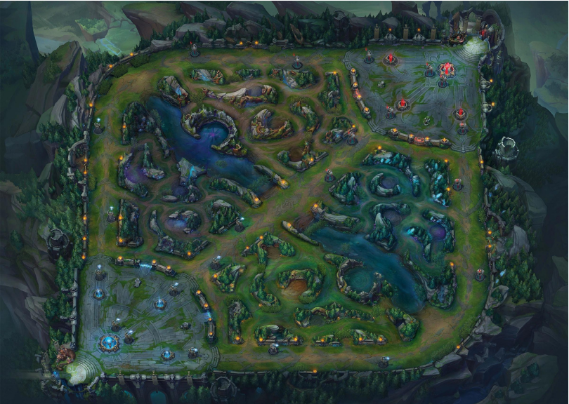

  

# League-of-Legends: How to Win

## Project Overview
This project explores data from League of Legends (LoL) to identify patterns and strategies that correlate with winning in this multiplayer online battle arena (MOBA) game. By analyzing match data and applying predictive models, this study aims to uncover insights into champion effectiveness, team compositions, and optimal in-game strategies, providing actionable advice for players seeking to improve their competitive performance.

## Approach
The analysis unfolds through a series of steps, incrementally building a data-driven model to interpret gameplay dynamics and predict match outcomes:

* Exploratory Data Analysis (EDA):

  * Begins with data cleaning, addressing missing values, duplicates, and other inconsistencies in match records.
  * Initial observations reveal insights such as average game lengths and win rates for teams starting on the blue versus red sides.
  * Examines metrics like champion picks, team objectives (e.g., towers, dragons), and game length variations to determine initial patterns related to winning.
* Predictive Modeling:

  * A random forest classifier serves as the initial model to predict match outcomes, using key features such as champion picks, team names, and objectives achieved.
  * Categorical variables are transformed using one-hot encoding, and the model’s accuracy is assessed on a test set.
  * Further model refinements may include additional features, feature engineering, and experimentation with different models or ensemble techniques.
* Evaluation:

  * Statistical Analysis: Validates findings using statistical tests to ensure patterns are significant and not due to random variation.
  * Model Performance: Evaluates predictive accuracy through metrics like accuracy, precision, recall, and F1 score. Cross-validation helps verify model generalizability across various datasets.
  * Feature Importance: Identifies the most influential features for predicting match outcomes, offering strategic insights for players.
* Game Strategy Insights:

  * Identifies critical game events that significantly influence match outcomes, such as early game advantages, objective control, and high-impact champion picks.
  * Strategy optimization includes suggestions for champion selection, role assignments, and in-game decision-making.
  * Future iterations may involve incorporating AI-driven insights to reveal hidden gameplay strategies or simulate potential game scenarios.
## Results and Future Directions
* Preliminary Findings: Initial model results indicate certain in-game actions, such as securing objectives (e.g., Baron, Dragon), strongly impact win probability. Further analysis is needed to fully leverage these insights in live gameplay.
* Future Improvements:
Incorporate a broader set of features, including detailed in-game events and champion performance metrics.
Experiment with more complex models and real-time feedback mechanisms for strategy adaptation.
Utilize community feedback and backtesting with historical data to refine model predictions and strategy recommendations.
## References
